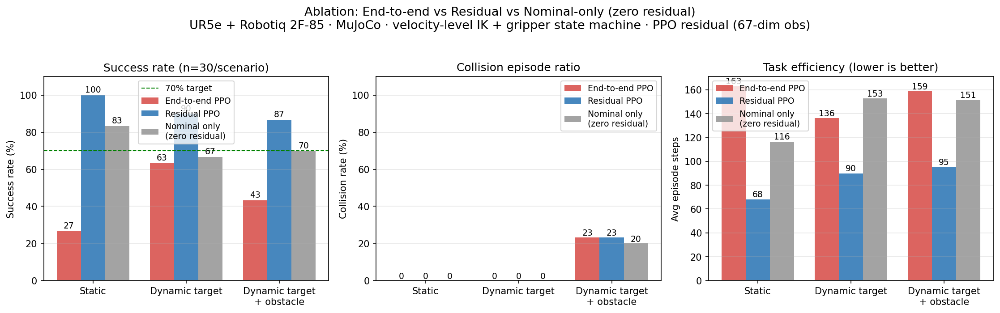

# 强化学习抓取系统

这是一个独立的、基于强化学习的机械臂抓取系统，采用**混合残差架构**（自实现速度场标称层 + PPO 残差修正）
训练 UR5e + Robotiq 2F-85 执行"到达并抓取"任务（MuJoCo 仿真，动态目标 + 动态障碍避障）。

> ⚠️ 标称层是**本仓库自实现的仿真速度场 / 运动学 MPC**，**不是 MoveIt**。
> MoveIt 只出现在部署端设计（见 `docs/RL_DEPLOY_CONTRACT.md` 与顶层 `docs/简历项目知识整理.md` §12）。

## 📊 核心结果：三路消融对比（2026-08-28）

> 口径：**确定性**评估（`deterministic=True`）、**n=30/场景**、物体位置固定；三路模型均在当前环境
> （扩大桌面 0.70m）**未重训**下评估。证据：`results/ablation/summary_table.txt` + `results/ablation/*.json`。

混合残差架构（`v = v_nominal(t) + Δv`）在三类场景下**均优于**端到端 PPO 与纯标称（零残差）：

| 场景 | 端到端 PPO | 残差 PPO | 纯标称（零残差） |
|---|---|---|---|
| 静态无障 | 26.7% | **100%** | 83.3% |
| 动态目标（0.05 m/s） | 63.3% | **90.0%** | 66.7% |
| 动态目标 + 动态障碍 | 43.3% | **86.7%** | 70.0% |



**结论**（失败归因详见 `docs/2026-08-27_RL训练失败分析_v5到v12b.md`、`docs/2026-08-28_RL训练失败分析_v19v20_碰撞经济学过冲.md`）：
- **标称解决静态**：纯标称静态 83.3%——静态任务无需 RL 即可完成大部分，RL 只补偏差
- **残差解决动态**：动态场景残差 90%/86.7%，大幅领先纯标称 66.7%/70%——"RL 学偏差"优于"RL 重学任务"
- **端到端均不如残差**：端到端全场景最差（8 版端到端失败归因 = 任务分解 / 奖励经济学问题）
- **域变化鲁棒性**：三路均未在当前环境（扩大桌面 0.70m）重训，端到端对域变化最敏感（静态跌到 26.7%）、
  残差最鲁棒（静态仍 100%）——残差受域差影响小，契合 sim2real（`docs/sim_to_real动力学匹配方案.md`）

**复现**：
```bash
bash scripts/run_ablation.sh     # 三路 × 三场景 × n=30 评估 → results/ablation/*.json
python scripts/plot_ablation.py  # 生成 results/ablation_compare.png 对比图
```

## 🧪 第二代：MPC 标称层 + 残差（部分成功／进行中）

标称层已升级为**运动学 MPC**（SLSQP 滚动最优控制，`mpc_nominal.py`）。评估脚本
`scripts/mpc_plus_rl_eval.py`（支持 `--zero-residual` 纯标称、`--nominal-mode mpc`、
`--ctrl-delay-steps` 执行延迟扰动、`--seed` 固定随机源）。

| 场景 | v24（cap 未解耦） | v25b2（cap 解耦+门控） | 纯 MPC（n=30） |
|---|---|---|---|
| 动态目标 | 73.3% / 0% coll | 80.0% / 0% coll | **83.3%** / 0% coll |
| 动态目标+障碍 | 86.7% / 3.3% coll | 76.7% / 0% coll | **90.0%** / 0% coll |
| mixed3（高密度） | 0% / 86.7% coll / avg 40.03 | 6.7% / 36.7% coll / **avg 1.17** | — |
| mixed_z | 13.3% / 80% coll / avg 25.57 | 13.3% / 33.3% coll / **avg 0.73** | — |
| static3 | 0% | 0% | — |

**诚实结论**（完整版见 `../docs/简历项目知识整理.md` §0/§9 与 `../docs/数字真值表_20260910.md`）：
- cap 解耦带来**安全增益**：高密度障碍平均碰撞 **34×↓**（40.03→1.17）；
- **但不是成功率增益**：mixed3 成功 0%→6.7%，mixed_z 持平；
- **残差未在成功率上打赢纯 MPC**（动态+障碍 76.7% vs 90.0%）；
- **static3 全版本 0%**（根因是运动学、只建模末端点的 MPC 规划不出绕行——已证伪「`D_SAFE` 几何拒行」旧说法，未解）。
- ⚠️ 评估脚本此前**无 seed 控制**，存在 ±8~17pp 采样噪声；「高几个百分点」级结论不可信。

## 系统特点

### 🎯 核心功能
- **独立模块**: 环境 / 训练 / 评估自包含，外部依赖仅 MuJoCo 场景 `../models/universal_robots_ur5e/`
- **PPO算法**: 基于Stable-Baselines3的PPO实现
- **归一化技术**: 观察归一化、奖励归一化、优势函数归一化
- **云端支持**: 无头渲染，适用于云端训练
- **完整监控**: 训练进度、成功率、奇异点检测等

### 🔧 技术架构
- **环境**: MuJoCo + UR5e + Robotiq 2F-85
- **任务**: 到达并抓取（动态目标 / 动态障碍），混合残差架构
- **算法**: PPO（Stable-Baselines3）+ VecNormalize 完整归一化
- **监控**: 实时训练监控和可视化
- **部署**: 云端无头训练支持

## 快速开始

### 1. 安装依赖
```bash
cd rl_grasping_system
pip install -r requirements.txt
```

### 2. 云端训练
```bash
python train_cloud.py
```

### 3. 本地训练（带监控）
```bash
python train_with_monitor.py
```

### 4. 评估模型
```bash
python evaluate.py --model_path models/final_model.zip
```

## 系统架构

### 核心模块

#### 1. 环境模块 (`environment.py`)
- **GraspingEnv**: 基于 MuJoCo 的抓取环境（UR5e + Robotiq 2F-85）
- **状态空间**: **67 维**——关节位置/速度/力矩(18) + 夹爪(3) + 末端位姿/速度(13) + 目标(7) + 诊断/接触力(7) + 相对接近姿态四元数(4，P2-2：`q_target_approach ⊗ q_ee⁻¹`) + 夹爪相位(1) + **标称参考速度(6)** + **障碍相对位姿/速度(6)**
- **动作空间**: 末端位姿增量（action_space_dim=6 → [dx,dy,dz,dax,day,daz]；=3 → [dx,dy,dz] 仅位置、姿态固定朝下），经 DLS IK 反解为关节位置伺服目标；夹爪由环境内"近距自动闭合状态机"驱动（RL 不再输出肌腱命令）
- **奖励函数**: 距离势能塑形、方向项、接触、抓取/完成奖励、时间惩罚（P3：抓取成功 = 手指被物体挡住合不上）

#### 2. 智能体模块 (`agent.py`)
- **GraspingAgent**: PPO智能体封装
- **GraspingCallback**: 抓取任务专用回调函数
- **早停机制**: 基于成功率的智能早停
- **模型管理**: 保存/加载/评估功能

#### 3. 配置管理 (`config.py`)
- **GraspingConfig**: 抓取任务配置
- **NetworkConfig**: 网络架构配置
- **TrainingConfig**: 训练参数配置
- **RewardConfig**: 奖励函数配置
- **SystemConfig**: 系统配置

#### 4. 归一化系统 (`vec_normalize_wrapper.py`)
- **VecNormalizeWrapper**: 观察和奖励归一化
- **RunningMeanStd**: 在线统计计算
- **裁剪机制**: 防止归一化值过大

#### 5. 训练监控 (`training_monitor.py`)
- **TrainingMonitor**: 完整的训练监控系统
- **实时图表**: 奖励、成功率、奇异点统计
- **日志记录**: 详细的训练日志
- **早停支持**: 基于性能的智能早停

#### 6. 安全机制
- **SingularityHandler**: 奇异点检测和处理
- **SafeActionWrapper**: 动作安全约束
- **碰撞检测**: 防止机械臂碰撞

## 配置说明

### 训练配置
```python
# 基本参数
total_timesteps: int = 50000  # 总训练步数
learning_rate: float = 3e-4     # 学习率
batch_size: int = 1024          # 批次大小
n_steps: int = 1024             # 每轮步数

# 归一化参数
normalize_observations: bool = True  # 观察归一化
normalize_rewards: bool = False      # P1: 关闭奖励归一化（奖励已由 P1.3 势能塑形有界化）
norm_obs_clip: float = 10.0         # 观察裁剪
norm_reward_clip: float = 10.0      # 奖励裁剪
```

### 奖励配置（P1.3 势能塑形 + P2-1 方向项/抓取门控，见 reward.py）
```python
# 位置目标 = 物体中心正上方（pre-grasp 位姿，hand 基座物理可达）
pre_grasp_offset_z: float = 0.10   # hand 基座悬停高度

# 距离/方向势能（低=好）；单步奖励 = Φ(s_prev) − γ·Φ(s)，γ=shaping_gamma
w_xy: float = 2.0                  # 平面距离权重
w_height: float = 2.0              # 高度权重
xy_scale: float = 0.3              # 平面距离归一化尺度(m)
height_scale: float = 0.15         # 高度归一化尺度(m)
w_orient: float = 5.0              # 方向奖励权重：gain = w_orient * (-z_axis_z)
shaping_gamma: float = 0.99        # 势能塑形折扣

# 事件奖励（一次性/每步，量级与典型单步奖励相当）
w_contact: float = 1.0             # 手指接触物体
grasp_reward: float = 5.0          # is_grasped（P3：手指被物体挡住合不上，开度仍 > grasp_min_width）
completion_reward: float = 10.0    # grasp_success
step_penalty: float = 0.01         # 时间惩罚
```

> **P2-1 方向项（已改）**：旧实现是 `w_orient*max(0, align)`（align=手指与目标
> 抓取姿态的四元数对齐 cos(θ)）。当夹爪与目标夹角 θ>90° 时 max(0,·) 截断使梯度恒为 0，
> 形成死区——策略学到“横夹/侧夹物体骗成功”，可视化里夹爪总不竖直向下。
> 新实现改为 **手指朝下投影** `gain = w_orient * (−z_axis_z)`（z_axis_z=手指方向世界
> Z 分量）：朝下 +1、水平 0、朝上 −1，全程连续有梯度，且不过度约束绕手指轴的自转
> （roll），保留 `align` 仅作诊断。

> **P2-1 抓取门控（已加）**：`GraspingConfig.min_finger_down_z = −0.9`。`is_grasped` /
> `grasp_success` 除原有 距离+夹紧+双指接触 外，新增 **手指方向门控**：须 `z_axis_z
> ≤ min_finger_down_z`（手指在世界系下基本朝下）才算成功。横夹/朝上不再被当作成功。
> 设 `min_finger_down_z=0.0` 可关闭方向检查（等价旧行为）。
> **P3 抓取判定重构（已改，替代 P2-1 门控）**：动作空间改为末端位姿增量（6/3 维），夹爪由近距自动闭合状态机驱动（`gripper_close_distance` 触发、`gripper_open_distance` 滞回），抓取成功 = 手指被物体挡住合不上（闭合后开度仍 > `grasp_min_width=0.02` 且双指接触）；已移除全部 lift 原语（`run_lift_primitive`/`lift_height`）。旧模型（8 维动作/57 维观测）不兼容，需重训。详见 `docs/P3_末端位姿控制与动作空间重构设计.md`。
> **P4 成功后的抬升（已加）**：`grasp_success` 后环境自动进入抬升状态机，夹爪保持闭合
> 并向上抬升 `lift_height=0.2m`（`lift_speed=0.003m/步`，实测 0.01 太快会 ~10 步甩脱、
> 0.005 仍有 ~6% 滞后滑移，0.003 时物体 100% 刚性跟随、~494 步到位），
> 到位或失夹/超时即结束 episode；成功时在 MuJoCo 原生窗口左上角叠加显示 "succeed"。
> P4 物理修复（2026-08-20）：`max_steps` 只计抬升前步数（抬升是自动阶段 ~494 步，不消耗
> RL 预算，见 `environment.step` 的 truncated 判定）；`ur5e_robotiq_cube.xml` 指尖衬垫接触加硬
> （`solref=0.001/0.999`）+ 主衬垫加宽加高，使 64g 立方体在抬升中不蠕动倾覆（默认软接触
> 下 ~0.075m 即滑脱；加硬 + `lift_speed=0.003` 后稳定跟随 100%、宽度不滑脱）。

## 归一化技术

### 1. 观察归一化
- **目的**: 稳定训练，避免不同特征尺度差异
- **实现**: 在线计算均值和方差
- **裁剪**: 防止归一化值过大

### 2. 奖励归一化
- **目的**: 稳定梯度，避免奖励爆炸
- **实现**: 在线计算奖励统计量
- **裁剪**: 限制奖励范围

### 3. 优势函数归一化
- **目的**: 提高策略更新稳定性
- **实现**: PPO算法内部自动处理
- **方法**: GAE (Generalized Advantage Estimation)

## 训练监控

### 实时指标
- **Episode奖励**: 每个episode的总奖励
- **成功率**: 抓取成功的episode比例
- **平均步数**: 完成任务的步数统计
- **奇异点检测**: 机械臂奇异点统计

### 可视化图表
- **训练曲线**: 奖励、成功率、步数趋势
- **分布图**: 奖励分布、步数分布
- **实时更新**: 每2000个episodes自动保存

## 云端部署

### 环境设置
```bash
# 设置无头渲染
export MUJOCO_GL=egl
export DISPLAY=:0

# 运行云端训练
python train_cloud.py
```

### 特点
- **无头渲染**: 完全避免图形界面依赖
- **CPU优化**: 强制使用CPU，避免GPU警告
- **错误处理**: 完善的异常处理和日志记录
- **自动保存**: 定期保存模型和图表

## 性能优化

### 网络架构
```python
# 策略网络
policy_hidden_sizes: [512, 512, 256]

# 价值网络
value_hidden_sizes: [512, 512, 256]
```

### 训练参数
- **学习率**: 3e-4 (适中)
- **熵系数**: 0.01 (促进探索)
- **GAE lambda**: 0.95 (优势估计)
- **裁剪范围**: 0.2 (PPO裁剪)

## 故障排除

### 常见问题

#### 1. 观察类型错误
```
Exception: Unrecognized type of observation <class 'tuple'>
```
**解决方案**: 确保VecNormalizeWrapper返回正确的numpy数组格式

#### 2. 图形渲染失败
```
Cannot initialize a EGL device display
```
**解决方案**: 使用云端训练脚本，设置无头渲染

#### 3. 训练不收敛
**解决方案**: 
- 检查奖励函数设计
- 调整网络架构
- 增加训练步数
- 启用归一化

## 项目状态

### ✅ 已完成
- [x] 独立RL抓取系统架构
- [x] PPO智能体实现
- [x] 完整归一化技术
- [x] 云端训练支持
- [x] 训练监控系统
- [x] 安全机制实现

### 🔧 技术改进
- **归一化**: 观察/奖励归一化 + PPO内置优势函数归一化
- **云端优化**: 无头渲染、CPU训练、错误处理
- **监控增强**: 实时图表、早停机制、详细日志


### 笔记

奖励曲线
含义：每个 episode 的总奖励是多少
作用：最核心的“学习效果”指标
你应该看：
如果它一直上升，说明策略在变好
如果它震荡很大，说明训练不稳定
如果它长期不升，说明奖励设计或环境可能有问题

成功率曲线
含义：最近 10 个 episode 中，有多少比例成功完成抓取
作用：比奖励更直接，反映“任务是否真的学会了”

奇异点统计
含义：机械臂发生奇异点的次数
作用：反映机械臂是否“走到了不健康的姿态”
你应该看：
奇异点越少越好
如果它突然变多，说明策略开始走偏，可能把机械臂推到危险姿态

Episode 长度
含义：每个 episode 结束前用了多少步
作用：反映任务是否越来越高效
如果长度越来越短，说明机器人越来越快完成任务
如果长度越来越长，说明它可能在原地打转，或者没有学会高效策略

如果奖励在涨，但成功率不涨
说明：你的奖励函数可能“骗过”智能体，它学会了拿到高 reward，但没有真正学会抓取
你可以考虑：
调整奖励函数，让成功抓取的奖励更明显
减少“只靠靠近物体就能拿高分”的奖励设计

如果成功率低，且奇异点多
说明：策略在尝试危险动作，机械臂可能学到了一些不稳定的控制方式
你可以考虑：
增加安全约束
降低动作幅度
调整奖励，惩罚危险姿态

如果奖励和成功率都很波动
说明：训练不稳定，可能是学习率、批次大小、熵系数或归一化设置不合适
你可以考虑：
降低学习率
调整 PPO 的 ent_coef
增加训练稳定性

如果 episode 长度越来越长
说明：智能体可能没有学会快速完成任务，或者环境终止条件不够利于它学习
你可以考虑：
缩短最大步数
调整任务目标，让它更容易学到“快速完成”

最实用的判断标准
你可以把它们看成三个层次：
奖励曲线：看“有没有学到东西”
成功率：看“有没有真正完成任务”
奇异点/episode 长度：看“是不是学得很不稳或很低效”


成功率有没有从低往上走
奇异点有没有明显增多
奖励曲线是否持续上升而不是只偶尔冲高

## 文件结构

```
rl_grasping_system/
├── environment.py              # 抓取环境
├── agent.py                   # PPO智能体
├── config.py                  # 配置管理
├── training_monitor.py        # 训练监控
├── vec_normalize_wrapper.py   # 归一化包装器
├── train_cloud.py            # 云端训练脚本
├── train_with_monitor.py     # 本地训练脚本
├── evaluate.py               # 模型评估（--zero-residual 支持纯标称评估）
├── singularity_handler.py    # 奇异点处理
├── action_wrapper.py         # 动作安全包装
├── state.py                  # 状态处理
├── reward.py                 # 奖励函数
├── scripts/
│   ├── run_ablation.sh       # 三路消融评估（端到端/残差/纯标称 × 3 场景）
│   ├── plot_ablation.py      # 消融对比图生成
│   └── ...                   # 更多验证/诊断脚本
├── requirements.txt          # 依赖列表
└── README.md                # 本文件
```

## 许可证

MIT License
